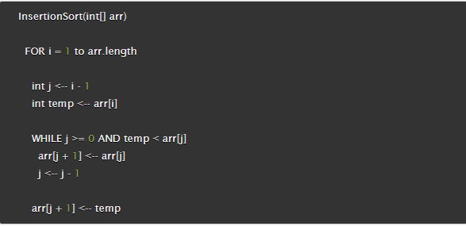

# Code Challenge - Class 26

## Code Challenge Topic: Insertion Sort

### Author: Timothee Odushina

### Problem Domain

Review the pseudocode below, then trace the algorithm by stepping through the process with the provided sample array. Document your explanation by creating a blog article that shows the step-by-step output after each iteration through some sort of visual.

Once you are done with your article, code a working, tested implementation of Insertion Sort based on the pseudocode provided.

### Pseudocode

### Sample Arrays

In your blog article, visually show the output of processing this input array:

[8,4,23,42,16,15]

For your own understanding, consider also stepping through these inputs:

* Reverse-sorted: [20,18,12,8,5,-2]
* Few uniques: [5,12,7,5,5,7]
* Nearly-sorted: [2,3,5,7,13,11]

### Implimentation

* Provide a visual step through for each of the sample arrays based on the provided pseudo code
* Convert the pseudo-code into working code in your language
* Present a complete set of working tests

### Code

const insertionSort = (nums) => {
  for (let i = 1; i < nums.length; i++) {
    let j = i - 1
    let tempValue = nums[i]
    while (j >= 0 && nums[j] > tempValue) {
      nums[j + 1] = nums[j]
      j--
    }
    nums[j+1] = tempValue
  }
  return nums
}

console.log(insertionSort([26, 5, 36, 9, 10, 0, 12]));

### Big O
O(n). We will need to loop through the array n time

### Algorithm

* The sorted array in the array is the value of elements on the left of the key;
* The unsorted array in the array is the value of elements on the right of the key;
* Select the first unsorted element;
* Swap other elements to the right of the array to create the correct position and shift the unsorted element;
* Advance the marker to the right one element
